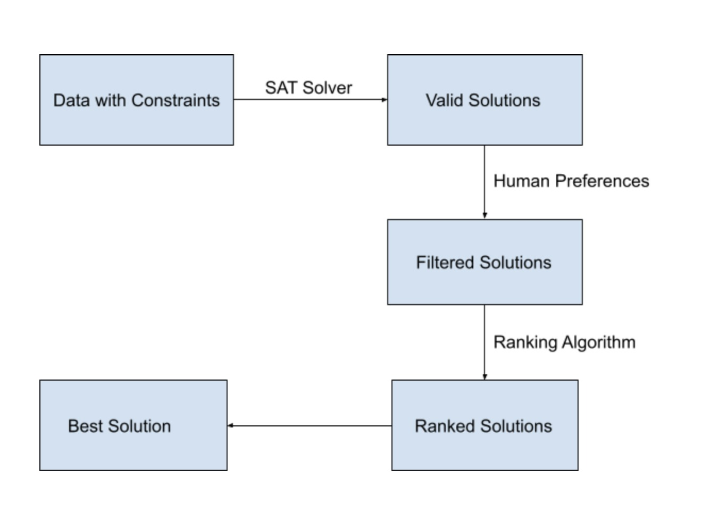

[](https://github.com/ai-se/whun/blob/main/LICENSE) 
[](https://github.com/ai-se/whun/issues)
[](https://arxiv.org/abs/2106.03792)


[](https://app.travis-ci.com/ai-se/whun)
[](https://coveralls.io/github/ai-se/whun?branch=feature-se2021)
# **About WHUN**
This repository is the official implementation of [Preference Discovery in Large Product Lines](https://arxiv.org/pdf/2106.03792.pdf "Preference Discovery in Large Product Lines") **

AI tools can generate many solutions, some human preference must be applied to determine which solution is
relevant to the current project.One way to find those preferences is interactive search-based software engineering (iSBSE) where
humans can influence the search process. Current iSBSE methods can lead to cognitive fatigue (when they overwhelm humans with
too many overly elaborate questions.WHUN is an iSBSE algorithm that avoids that problem. Due to its recursive clustering procedure,WHUN only pesters humans for O(log2N) interactions. Further, each interaction is mediated via a feature selection procedure that reduces the number of asked questions. When compared to prior state-of-the-art iSBSE systems, WHUN runs faster, asks fewer questions, and achieves better solutions that are within 0.1% of the best solutions seen in our sample space. More importantly, WHUN scales to large problems (in our experiments, models with 1000 variables can be explored with half a dozen interactions where, each time, we ask only four questions). Accordingly, we recommend WHUN as a baseline against which future iSBSE work should be compared.

### **Video**

https://app.animaker.com/video/VOSL7A6ONJOVJSG3

### **WHUN Algorithm**

WHUN is based on iSBSE method and it is applied on few data sets to prove its efficiency. The data model is obtained from the [Splot Research](http://www.splot-research.org "Splot Research") website. The data is in the binary format. Along with data for every model we have a set of constraints which makes the solution suitable. To achieve this the constraints are applied to the data set using a PICO SAT solver, which removes all the data points which do not fit into the constraints. This step reduces the size of the data set to a significant amount. Next step is where the iSBSE approach starts. Here human preferences are given in form of questions to Oracle, which choses an answer at every step in the binary clustering to eliminate many solutions. At the end of this we would be left with roughly 10% of the original data set. However, we need to find a best possible solution. For this the paper applies a ranking algorithm to rank all the solutions and pick the best. 

### **Flow Chart**
<br />

<br />

### **Current Progress**

Code Refactoring : 

1. Code Modularization to remove tight coupling.
2. Removal of unused packages
3. Made hardcoded variables configurable
4. Static code analyser report before and after code refactoring

Packaging :

1. Created a python package out of whun called as "whun" which can be downloaded using pipy.
2. This package can be used to wun whun by calling whun_run method with appropriate arguments.
3. Example command to run whun_run: whun_run(['Scrum10k.csv'], ['flight_eval.csv'])

Unit Testing:

1. Added unit test cases for all the method of helper classes.
2. Code coverage increased to 85%.

CI Pipeline:

1. Integrated whun with Travis.

GUI Support For Human Interaction:

1. Created support for human interaction using system based User Interface.
2. Implemented GUI using PyQT5.
3. Provided support to run whun with human interaction or with oracle.

Bug Reporting

1. Integrated with google forms and zapier for service reporting.
2. A user can report bugs using the google form which would create a bug in the jira board.
3. Google Form Link: https://forms.gle/p265qYXY1A3Y6nHFA

Flight Model To Scrum

1. Migrated from flight model to scrum model.
### **Future work on WHUN**

1. Update python package to support GUI Human Interaction.
2. Identifying the relationship among features in order to sequence the question.

## **Developer Guide**

### **Requirements**

To install requirements:
```
pip install -r requirements.txt
```

### **Installation**
```
python3 whun.py
```
### **Static Analysis Report**

Run pylint checker to perform style checking
In order to run the pylint package, first make sure the virtual environment is up and running and then check if the pylint package is installed in the virtual environment or not.
To install pylint in the virtual environment, run the command 
```
pip install --upgrade pylint
 ```
in the virtual environment session.
Then, run the below command, which will give you the list of pylint errors if any.
```
pylint <filename>
```
If you want the save the lint errors then run the following command : 
```
pylint <SourceFileName> >> <LintErrorsOutputFIleName>
```

Run following command to get the WHUN static analyzer report in sa_reports directory: 
```
sh run_sa.sh
```
After fixing the lint issues you can run back the command to check if the issues are resolved or not.

### **Virtual Env**
This is a one time setup of a virtual environment that is needed to perform subsequent linting and formatting checkers.
Install virtualenv with : 
```
pip install virtualenv
```
Now to create a virtual environment run following command where whunenv is the name of the virtual environment in your local.
```
python -m venv .\whunenv
```

Now go into the whunenv folder and run the following command to start the virtual env and to keep it running in the terminal session.
This step needs to be done every time you want to start your virtual environment.
```
. Scripts/activate
```
We need to perform following command in the virtual environment as it will not have the references to the packages that are already installed in your machine and it needs the local copies of the packages to be present in the virtual environment itself.
```
pip install <PackageName>
```

### **Code Formater**
Run autopep8 to perform formatter checking
In order to run the autopep8 package, first make sure the virtual environment is up and running and then check if the autopep8 package is installed in the virtual environment or not.
To install autopep8 in the virtual environment, run the following command in the virtual environment session :
```
pip install --upgrade  autopep8
```

### **Unit Testing**
Every time a method is being changed or a new method is being added, we need to write Unit test cases inorder to maintain the code coverage and to follow best practices.
We have a folder called as test in the root directory where we have a python test file for each class we have created.
Each test file will have test methods testing different methods of the class that test file belongs to.
If you want to add a new test file for new class then create a file inside test folder whose name should start with a suffix "test_".
If you want to add a new test method for new method in class then create a new method inside test file whose name should start with a suffix "test_".
TO check the current coverage run the below commands in the terminal in the root folder.
```
python3
# Run this to see the coverage in command line
coverage run --source=./src/whun/whun_helper,./src/whun/utils --omit=./src/whun/whun_helper/ui_helper.py -m pytest && coverage report
# Run this to see the coverage in html format with line by line details of each file
coverage run --source=./src/whun/whun_helper,./src/whun/utils --omit=./src/whun/whun_helper/ui_helper.py -m pytest && coverage html
```

### **GUI for Human Interaction**
Inorder to run WHUN with human interaction you need to execute the "whun_run" method with the required file name attributes and "is_oracle_method" flag as False.

When the whun_run method executes it will open a window with user interface. User can proceed using the GUI to run WHUN and choose his/her preferences accordingly.

Below is a sample snippet on how to execute the whun_run method.
```
whun_run(['Scrum10k.csv'], ['flight_eval.csv'], False)
```

### **Potential Users**
WHUN algorithm is meant to be a substitute for existing iSBSE algorithms which are not as effective as WHUN algorithm.
Therefore, WHUN can be used in any large product lines that need effective and efficient iSBSE products.

### **Version Release Timeline**
Release v1.0.1 on 09/30/2021<br/>
Release v2.0.1 on 11/04/2021<br/>
Release v3.0.1 on 12/04/2021

### **Group 37 Details:**

1.) Akhil Gangarpu Sudhakar (<agangar@ncsu.edu>)<br />
2.) Jaydeep Patel (<jpatel33@ncsu.edu>)<br />
3.) Shubham Waghe(<swaghe@ncsu.edu>)<br />
4.) Venkata Sai Teja Malapati(<vmalapa@ncsu.edu>)<br />
5.) Vijaya Durga Kona(<vkona@ncsu.edu>)<br />

### **Feature tracking**
[Jira Board](https://se2021-group37.atlassian.net/secure/RapidBoard.jspa?rapidView=1&selectedIssue=SEWE-37 "Jira Board")

### Release 1.0
1. Study of the research work
2. Modularization
3. Refactoring
4. Styler and Formatter
5. Kernel best practices
6. Initial Documentation

### Release 2.0

1. Packaging
2. Unit testing and code coverage
3. Travis integration
4. Short releases
5. No regression rule
6. Short Video

### Release 3.0
1. GUI for Human Interaction support
2. Fixing test cases and maintaining code coverage
3. Service reporting
4. Migrated flight model to scrum model
5. Created a demo video with UI interaction

### **References**
** Authors for [Preference Discovery in Large Product Lines](https://arxiv.org/pdf/2106.03792.pdf "Preference Discovery in Large Product Lines") : Andre Lustosa, Tim Menzies

